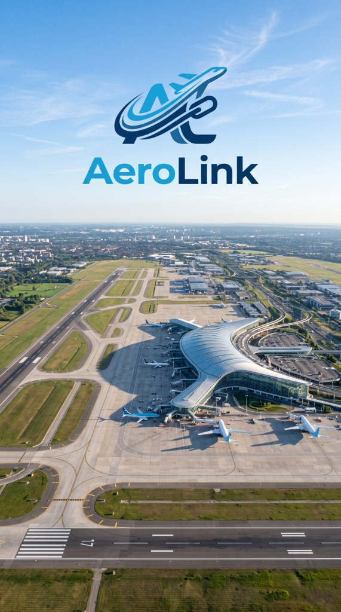

# AeroLink - Premium Private Jet Charter

Landing page mini website untuk **AeroLink** (Penyedia Jasa Transportasi Pesawat Carter Premium).



## ✈️ Fitur Utama
- **Hero Section**: Branding AeroLink, profil logo, background bandara & runway dengan CTA reservasi & share modal.
- **Tentang Kami & Sejarah Singkat**: Profil keselamatan, rekam jejak operasional, dan milestone perusahaan.
- **Layanan Kami**: Private Charter, Medical Evacuation (Medevac), Corporate Travel, dan Kargo Khusus.
- **Katalog Armada**: Gulfstream G650 (Heavy Jet), Cessna Citation Latitude (Midsize Jet), dan Embraer Phenom 300 (Light Jet) lengkap dengan foto asli, kapasitas pax, dan kecepatan jelajah.
- **Estimasi Harga & Lokasi**: Informasi rute populer dan integrasi Google Maps terminal VIP Bandara Tjilik Riwut.
- **FAQ Accordion & Testimonial**: Pertanyaan yang sering diajukan dan ulasan klien eksekutif.
- **Formulir Reservasi WhatsApp**: Generator pemesanan instan dengan format pesan WhatsApp otomatis.
- **Sticky CTA**: Tombol pemesanan cepat mengambang yang responsif saat scroll.

## 🛠️ Teknologi
- **React 18**
- **Vite**
- **Tailwind CSS**
- **Lucide React Icons**
- **TypeScript**

## 🚀 Cara Menjalankan Secara Lokal

1. **Clone repository ini:**
   ```bash
   git clone https://github.com/solusilokal/AeroLink.git
   cd AeroLink
   ```

2. **Install dependensi:**
   ```bash
   npm install
   ```

3. **Jalankan development server:**
   ```bash
   npm run dev
   ```
   Buka browser di `http://localhost:3000/`.

4. **Build untuk production:**
   ```bash
   npm run build
   ```

---
© 2026 AeroLink. Powered by [solusilokal.id](https://www.solusilokal.id).
